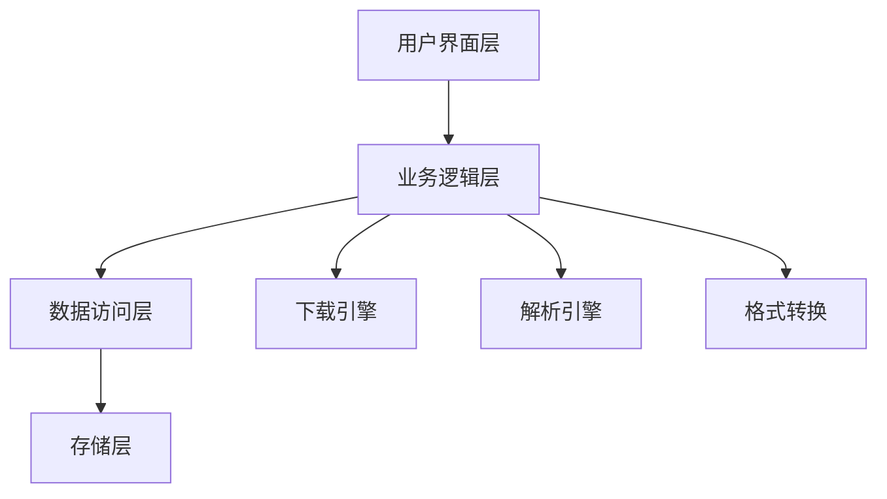

# 📚 七猫小说下载器 | Seven-Cat Novel Downloader

<div align="center">


**🌟 高效、优雅且功能强大的七猫小说下载解决方案 🌟**

[✨ 特性](#-特性) • 
[🚀 快速开始](#-快速开始) • 
[💻 使用指南](#-使用指南) • 
[🔄 自动化构建](#-自动化构建) • 
[❓ 常见问题](#-常见问题) • 
[📜 许可证](#-许可证)


## 🛠 技术架构



</div>

## ✨ 特性

<table>
  <tr>
    <td>
      <h3>📚 高质量内容获取</h3>
      <ul>
        <li>支持七猫小说全平台内容下载</li>
        <li>智能解析章节结构与内容</li>
        <li>自动校正小说格式与标点</li>
      </ul>
    </td>
    <td>
      <h3>🔄 多格式转换</h3>
      <ul>
        <li>支持输出纯净TXT格式</li>
        <li>生成精美排版的EPUB电子书</li>
        <li>保留原书籍章节结构</li>
      </ul>
    </td>
    <td>
      <h3>🖥️ 界面体验</h3>
      <ul>
        <li>直观友好的图形界面</li>
        <li>实时下载进度可视化</li>
        <li>跨平台一致性体验</li>
      </ul>
    </td>
  </tr>
  <tr>
    <td>
      <h3>⚡ 高效下载引擎</h3>
      <ul>
        <li>多线程并发下载技术</li>
        <li>智能调节网络请求频率</li>
        <li>断点续传与状态恢复</li>
      </ul>
    </td>
  </tr>
</table>

## 🚀 快速开始

### 🌐 在线下载（零安装，零依赖）

<details>
<summary><b>点击展开详细步骤</b></summary>

利用GitHub Actions的强大功能，无需在本地安装任何软件即可下载小说：

1. 在GitHub仓库页面，点击 **"Actions"** 选项卡
2. 左侧选择 **"七猫小说下载"** 工作流
3. 点击 **"Run workflow"** 按钮
4. 填写以下信息：
   - **小说ID**：从七猫小说页面获取
   - **输出目录**：选填
5. 点击 **"Run workflow"** 开始下载
6. 下载完成后，点击运行记录中的 **"Summary"** 标签
7. 在 **"Artifacts"** 部分找到并下载小说文件（保存期限为7天）

</details>

### 📦 一键式安装与使用

<details>
<summary><b>点击查看各平台预编译版本</b></summary>

从 [📥 官方发布页](https://github.com/rabbits0209/seven-cat/releases) 下载适合您系统的预编译版本：

| 平台 | 下载链接 | 说明 |
|------|---------|------|
| Windows | [`Fanqie-Novel-Downloader-Windows.zip`](https://github.com/rabbits0209/seven-cat/releases) | 解压后双击运行 `七猫小说下载器.exe` |
| MacOS | [`Fanqie-Novel-Downloader-MacOS.zip`](https://github.com/rabbits0209/seven-cat/releases) | 解压后运行 `七猫小说下载器` 应用 |
| Linux | [`Fanqie-Novel-Downloader-Linux.zip`](https://github.com/rabbits0209/seven-cat/releases) | 解压后运行 `七猫小说下载器` 可执行文件 |

</details>

### 💻 从源码运行（开发者选项）

<details>
<summary><b>点击展开开发者指南</b></summary>

```bash
# 1. 克隆代码仓库
git clone https://github.com/rabbits0209/seven-cat.git
cd seven-cat

# 2. 安装依赖库
pip install -r requirements.txt

# 3. 启动应用
python main.py
```

</details>

## 💻 使用指南

### 🔍 如何查找小说ID

在七猫小说网站上，打开您想要下载的小说页面，URL中的数字部分就是小说ID。

> 例如：`https://www.qimao.com/shuku/1879266/` 中的 `1879266` 就是小说ID。

### 📂 下载文件位置

- **应用**：下载的文件保存在您指定的保存路径中
- **在线下载**：文件将作为GitHub Artifacts提供下载，保存期限为7天

## 🔄 自动化构建

本项目采用现代化的CI/CD流程，通过GitHub Actions自动构建并发布多平台应用。

### ⚙️ 自动构建流程

当创建新的Release或手动触发工作流时，GitHub Actions会自动：

1. 在Windows、MacOS和Linux三大平台进行并行构建
2. 优化可执行文件大小和性能
3. 将构建产物打包为便于分发的压缩文件
4. 上传构建文件并创建正式发布页面

### 🚀 手动触发构建与发布

1. 在GitHub仓库页面，点击 **"Actions"** 选项卡
2. 左侧选择 **"构建与发布"** 工作流
3. 点击 **"Run workflow"** 按钮并填写版本信息
4. 等待自动化流程完成全部构建与发布

## ❓ 常见问题

<details>
<summary><b>遇到下载失败或速度慢的问题</b></summary>

- 尝试关闭代理
- 确保小说ID正确
- 确保网络连接稳定
</details>

<details>
<summary><b>应用无法启动或崩溃</b></summary>

- 确保您下载了正确的操作系统版本
- 检查系统是否满足最低要求
- 尝试重新下载最新版本

</details>

## 📜 许可证

本项目采用 [MIT 许可证](LICENSE) 进行授权和分发。

---

<div align="center">

**⭐ 如果这个项目对您有帮助，请考虑给它一个星标！⭐**

[反馈问题](https://github.com/rabbits0209/seven-cat/issues) • 
[贡献代码](https://github.com/rabbits0209/seven-cat/pulls) • 
[查看更新](https://github.com/rabbits0209/seven-cat/releases)

</div>
